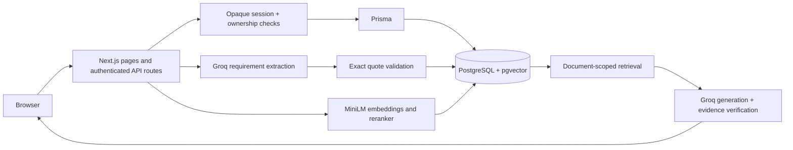

# BriefProof — deliver what the brief actually asks for

BriefProof helps student project teams and small agencies turn a project brief into a durable checklist with original evidence. Requirements buried in rubrics and client scopes become visible commitments that can be reviewed, completed and exported.

This capstone extends the existing Document RAG repository, preserving its ingestion, embeddings, retrieval, evidence checks and Git history.

## Product
- Public landing page and responsive private workspace.
- Email/password signup, login, logout and revocable database-backed sessions.
- Isolated, no-password demo with a preloaded sample brief and checklist.
- Paste a text brief or upload a text-based PDF up to 4 MB.
- Groq-powered extraction into features, deliverables, constraints and success metrics.
- Every saved requirement must contain an exact quote found in its original brief.
- Completion status persists across refreshes and logins; export to Markdown.
- Source questions reuse MiniLM + pgvector retrieval, reranking and evidence validation.
- Questions and answers are saved with the brief.
- Loading, empty, validation, error and success states.

## AI component and data handling
The model proposes a short actionable label and an exact source passage. The server validates category, bounds, duplicates and the verbatim quote before persistence. This verifies citation presence, not extraction completeness or the correctness of every interpretation. Users review the original brief beside the checklist.

The source-question pipeline retrieves document-scoped chunks, reranks evidence, generates a draft, checks support and returns original evidence with citations. Unsupported answers abstain. CPU MiniLM models are packaged and checksum-verified for Vercel; Groq performs hosted generation. Text is sent to Groq when AI extraction or source questions are requested. Do not upload documents you are not authorized to share with that provider.

## Architecture


Stack: Next.js 16.3.8 Pages Router, React 19, JavaScript, Prisma 6, PostgreSQL/pgvector, Hugging Face Transformers CPU inference, Groq, Vercel. TypeScript contracts validate the generated database schema; the existing JavaScript codebase is not a strict TypeScript migration.

## Database and authentication
- `User`: normalized unique email, name, salted scrypt password hash; demo accounts have no password.
- `Session`: SHA-256 hash of a random 256-bit cookie token, user and expiration. Regular sessions last seven days; demo sessions last 24 hours. Cookies are HttpOnly, SameSite=Lax and Secure in production.
- `Document`/`Chunk`: existing source storage and 384-dimensional vectors, with added account ownership.
- `Requirement`: source-backed checklist items and completion state.
- `Answer`: saved question/result JSON for a brief.
- `RateLimit`: database-backed fixed-window request counters.

Every document read/write/chat route checks ownership. Legacy documents retain their data with no assigned owner and are not exposed to new accounts. Migrations are additive. PostgreSQL RLS is enabled without browser-facing policies; the privileged server connection performs application access checks. No Supabase client credentials are shipped to the browser.

## Local installation
Use Node.js 24 and a PostgreSQL database that supports pgvector.

```powershell
npm install --onnxruntime-node-install=skip
Copy-Item .env.example .env.local
# Edit .env.local locally. Never commit it.
npm run db:generate
npm run db:migrate
npm run dev
```

Open `http://localhost:3000`. The local Docker option in `compose.yaml` is retained; see [the original technical guide](docs/RAG_ARCHITECTURE.md) for its setup and model details. Use the migration commands only against the intended database. Prisma needs a server role able to access tables after RLS is enabled.

## Environment variables
| Variable | Purpose |
| --- | --- |
| `DATABASE_URL` | Server-only PostgreSQL connection string. Required. |
| `GENERATION_PROVIDER` | `groq` for hosted source questions, or `local` for the retained optional Qwen path. |
| `GROQ_API_KEY` | Server-only Groq key. Required for checklist extraction and hosted source questions. |
| `GENERATION_MODEL` | Groq model, default `openai/gpt-oss-20b`; must support JSON mode. |
| `POSTGRES_PASSWORD` | Optional Docker database password. |

No signing secret is required: opaque session tokens are stored only as hashes in PostgreSQL. Checklist extraction always uses Groq; local Qwen is an optional source-question path only. Without a Groq key, AI extraction reports a clear configuration error while saved briefs and preloaded demo progress continue working. No fake AI fallback is used.

Local source questions may download model assets on first use. For local Qwen inference, `npm run models:download` prepares the existing models. Vercel uses build-packaged MiniLM assets and hosted generation rather than downloading a large LLM at request time.

## Validation
```powershell
npm run lint
npm run typecheck
npm test
npm run build
# Start the app before this real database/API test:
npm run test:capstone
```

`TEST_BASE_URL` selects a deployed URL; `TEST_AI=1` additionally exercises real hosted extraction, quote validation, completion persistence, embeddings, retrieval and a saved answer. The test creates isolated accounts with random in-memory credentials and prints only the account identifier for cleanup. Unit tests mock provider calls and do not consume inference credits. Validation evidence and deployment status are in [docs/VERIFICATION.md](docs/VERIFICATION.md).

## Deployment
Repository: https://github.com/riknesh77/document-rag-chatbot

Existing Vercel production alias: https://document-rag-chatbot-two.vercel.app

The alias alone does not prove this capstone version is deployed. See `docs/VERIFICATION.md` for the verified commit/deployment state. Vercel must use Node 24, the committed `vercel.json`, production database access and the server environment variables above. Build preparation downloads and validates the two small MiniLM models and checks function tracing, native bindings and size budgets. Database migrations must be applied before deploying a schema-dependent version; both capstone migrations were applied during implementation.

## Demo and capstone materials
- [Capstone brief](docs/CAPSTONE_BRIEF.md)
- [Three-minute demo script](docs/DEMO_SCRIPT.md)
- [Seven-slide pitch content](docs/PITCH_DECK.md)
- [Audit and decisions](docs/AUDIT.md)
- [Existing RAG architecture and model details](docs/RAG_ARCHITECTURE.md)

Open the homepage → Explore a private demo → Open a private demo. The sample checklist is preloaded and visibly labeled; create a new brief to demonstrate live AI extraction. A demo session stays in its browser for 24 hours, with no shared password. Create a regular account for login access across browsers.

## Screenshots
Desktop landing, private review and mobile review screenshots accompany the capstone deliverables. Capture fresh production screenshots after a release; do not present a development screenshot as proof of production deployment.

## Limitations
- AI can omit requirements or misinterpret a source. Verbatim evidence checks do not certify completeness.
- Text extraction supports text-based PDFs; no OCR or encrypted-PDF support.
- Checklist extraction supports briefs up to 22,000 characters; up to 30 briefs per workspace.
- No email verification, password recovery, MFA, collaboration or billing.
- Completion is a user-reported checkbox, not verification of delivered code.
- Hosted AI depends on provider quota/availability; first indexing can have a cold start.
- Legacy unassigned documents are preserved but require a deliberate administrator ownership migration to appear in an account.
- Demo accounts, expired sessions and old rate counters need periodic maintenance; no cleanup automation is provisioned.
- Engineering test signups are not a claim of real customer acquisition. Industry panel review is an external program activity.

## Future improvements
Email verification/recovery and MFA; team spaces and reviewer editing; version-to-version scope comparisons; a labeled extraction evaluation set; file deletion/account data management; scheduled demo cleanup; integrations and validated pricing.
